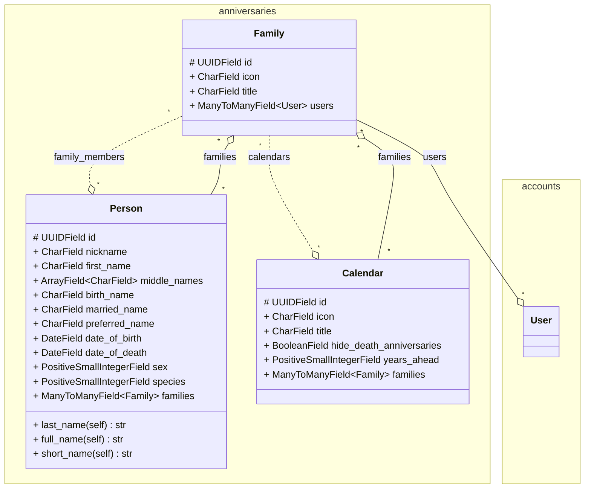

# anniversaries
An app to remember anniversaries (birthday, dating anniversary, wedding, etc.).

## data model

```mermaid
classDiagram
    direction TB

    namespace anniversaries {
        class Family {
            # UUIDField id
            + CharField icon
            + CharField title
            + ManyToManyField~User~ users
        }

        class Person {
            # UUIDField id
            + CharField nickname
            + CharField first_name
            + ArrayField~CharField~ middle_names
            + CharField birth_name
            + CharField married_name
            + CharField preferred_name
            + DateField date_of_birth
            + DateField date_of_death
            + PositiveSmallIntegerField sex
            + PositiveSmallIntegerField species
            + ManyToManyField~Family~ families
            + last_name(self) str
            + full_name(self) str
            + short_name(self) str
        }

        class Calendar {
            # UUIDField id
            + CharField icon
            + CharField title
            + BooleanField hide_death_anniversaries
            + PositiveSmallIntegerField years_ahead
            + ManyToManyField~Family~ families
        }
    }

    namespace accounts {
        class User
    }

    Family "*" --o "*" User : users

    Person "*" --o "*" Family : families
    Family "*" ..o "*" Person : family_members

    Calendar "*" --o "*" Family : families
    Family "*" ..o "*" Calendar : calendars
```
